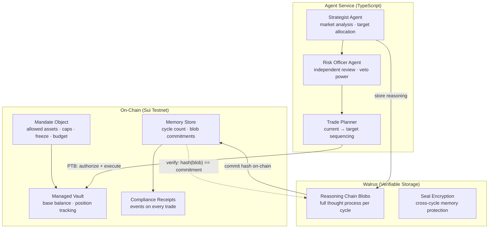
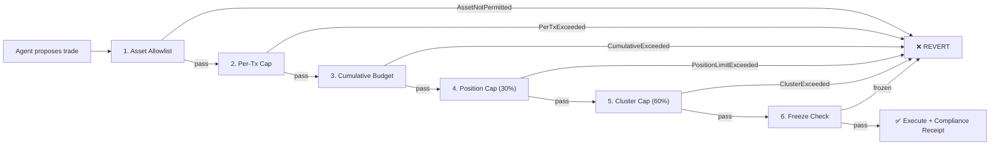

# Mandate Memory

**AI agents manage your DeFi portfolio. The Move contract enforces every rule. Walrus proves every decision.**

*A multi-agent portfolio system where every reasoning cycle is stored as verifiable memory on Walrus, and every trade is atomically enforced by Move objects on Sui. The agent can reason freely — but it cannot overspend, over-concentrate, or act without leaving a cryptographic audit trail.*

**Track:** Walrus (Sui Overflow 2026)

---

## The problem nobody's solved

AI agents are going to manage DeFi portfolios. That's inevitable. But there's a trust gap that neither "trust the AI" nor "never use AI" solves:

1. **Users can't verify WHY an agent traded.** Today's agent systems log decisions in a database the operator controls. They can rewrite history. You have the trade receipt — but not the reasoning that led to it.

2. **Agents lose context between sessions.** Every cycle starts cold. The agent repeats analysis, churns positions, and wastes gas on trades it would have skipped if it remembered its last run.

3. **Agent constraints live in code the agent controls.** A spending cap in Python is a suggestion. A spending cap in a Move object is a guarantee — the chain reverts violations regardless of what the agent's code says.

Existing solutions solve one of these. Nobody solves all three together:

| Approach | Constraint enforcement | Verifiable reasoning | Cross-session memory |
|----------|----------------------|---------------------|---------------------|
| Beep (Sui) | ❌ agent wallets, no mandate enforcement | ❌ | ❌ |
| Traditional DeFi vaults | ✅ smart contract rules | ❌ | ❌ |
| MemWal (standalone) | ❌ | ❌ | ✅ |
| **Mandate Memory** | ✅ Move objects + PTBs | ✅ Walrus blobs + on-chain hashes | ✅ Walrus + Seal |

---

## What it does

```
User deposits USDC + sets mandate (once)
    → Agent perceives live market data (SUI, DEEP, WAL prices)
    → Strategist Agent analyzes and sets target allocation
    → Risk Officer Agent independently reviews each trade
    → Approved trades execute atomically via PTB
        → Mandate cap check
        → Position limit check
        → Cluster concentration check
        → All-or-nothing: pass → execute | fail → REVERT
    → Full reasoning chain stored on Walrus (blob ID committed on-chain)
    → Anyone can verify: reasoning blob hash == on-chain commitment
```

---

## Why Sui specifically makes this work

This isn't "AI + a Sui wallet." Every Sui primitive is architecturally necessary:

| Sui Primitive | How it's used | Why it can't be done elsewhere |
|---------------|---------------|-------------------------------|
| **Move Objects** | The mandate IS an owned object. Agent's authority is a typed resource with `key + store`. Can't be copied, forged, or transferred without owner consent. | EVM: authority is an address mapping. Aptos: account-based. Only Sui has object-level ownership. |
| **PTBs** | One transaction: `authorize(mandate) → check_caps → execute_swap → emit_receipt`. All atomic, all composable, no re-entrancy. | EVM needs multiple internal calls with re-entrancy guards. PTBs compose safely by construction. |
| **Hot-potato pattern** | `MandateReceipt` has no `drop` ability. If `authorize` issues it, the vault MUST consume it in the same PTB or the tx fails. Partial enforcement is impossible by construction. | Unique to Move's linear type system. No equivalent in Solidity/Rust. |
| **Walrus** | Full reasoning chain (5KB-20KB per cycle) stored as a verifiable blob. On-chain hash commits the content. Auditor fetches blob, verifies hash, reads the agent's full thought process. | IPFS has no availability guarantee. Arweave is permanent but expensive. Walrus is Sui-native, erasure-coded, verifiable. |
| **Seal** | Cross-cycle memory is encrypted. Only agent + owner can decrypt. Prevents front-running of strategy signals. Programmable access: owner can grant read to an auditor temporarily. | No equivalent. Other chains need external KMS. Seal policies are on-chain Move logic. |

---

## Architecture



---

## The enforcement layers

Every agent buy is checked atomically in a single PTB:



The hot-potato `MandateReceipt` guarantees these checks and the execution happen in the same PTB — there is no path where the mandate is checked but the trade isn't recorded.

---

## The reasoning chain IS the product

Every cycle produces 6 phases rendered live in the UI:

```
PERCEIVE → ANALYZE → TARGET → PLAN → CRITIQUE → COMMIT
```

The COMMIT phase stores the full chain on Walrus and commits its hash on-chain. This means:
- **For the user:** "I can see exactly why the agent did what it did."
- **For an auditor:** "I can cryptographically verify the reasoning preceded the action."
- **For the agent:** "I remember my last 10 cycles and won't churn needlessly."

---

## Run it

```bash
# ── Move contracts ──
cd mandate_memory
sui move build
sui move test    # 6 tests, all enforcement paths

# ── Agent service ──
cd ../agent
npm install
cp .env.example .env   # add GROQ_API_KEY (free tier)
npx tsx src/server.ts  # http://localhost:3002

# ── Try it ──
curl -X POST http://localhost:3002/api/plan | jq .summary
curl -X POST http://localhost:3002/api/execute -H "Content-Type: application/json" -d '{"cycleId": 1}'
curl http://localhost:3002/api/memory | jq .
```

---

## Repository layout

```
sui-overflow/
├── mandate_memory/            Move package (Sui)
│   ├── sources/
│   │   ├── mandate.move       Agent authority object + kill switch
│   │   ├── vault.move         Asset vault + atomic enforcement
│   │   └── memory.move        Walrus blob registry + cycle commitments
│   └── tests/
│       └── mandate_tests.move 6 tests covering every revert path
│
├── agent/                     TypeScript agent service
│   └── src/
│       ├── agent.ts           6-phase reasoning loop (Strategist + Risk Officer)
│       ├── signals.ts         Live market data (CoinGecko)
│       ├── walrus.ts          Walrus blob storage + retrieval
│       ├── config.ts          Sui/Walrus/LLM configuration
│       └── server.ts          Express API
│
└── README.md                  ← you are here
```

---

## Tech stack

| Layer | Choice | Why |
|---|---|---|
| Smart contracts | **Sui Move** | Object ownership, PTB atomicity, hot-potato pattern |
| Agent reasoning | **Groq (Llama 3.3 70B)** | Free tier, fast, two-agent system |
| Market data | **CoinGecko** (live SUI/DEEP/WAL prices) | Free, reliable |
| Verifiable memory | **Walrus** | Sui-native, erasure-coded, hash-verifiable |
| Memory encryption | **Seal** | Programmable access, on-chain policies |
| Backend | **TypeScript · Express** | Lightweight, portable |
| Frontend | **Next.js · Tailwind** | (coming) |

---

## What makes this different from "another AI DeFi bot"

1. **The mandate is a Move object.** Not a config file. Not a database row. A typed, owned resource that the chain enforces. The agent literally cannot overspend because the type system prevents it.

2. **Two agents, not one.** The Strategist proposes; the Risk Officer independently vetoes. Different prompts, different concerns. This catches the errors a single agent wouldn't.

3. **Walrus reasoning = verifiable audit.** Every decision is stored before execution. The hash links reasoning to action cryptographically. You can't forge the audit trail retroactively.

4. **Cross-cycle memory prevents churn.** The agent references its prior decisions, computes drift, and holds when nothing changed. Memory is on Walrus — portable, not locked to any provider.

5. **The hot-potato pattern makes partial enforcement impossible.** If `authorize()` fires, `consume_receipt()` MUST fire in the same PTB. There's no state where the cap was checked but the trade wasn't recorded.

---

## Honest limitations

- **Trading is simulated in demo mode.** The vault tracks positions as accounting entries. Production would route through DeepBook. The enforcement logic (caps, cluster, freeze) is identical either way.
- **Seal integration is planned, not shipped.** Memory encryption via Seal is the next step. The on-chain commitment + Walrus storage works today without it.
- **Solo build.** One person, two weeks. The product stands on technical merit.

---

## License

MIT
