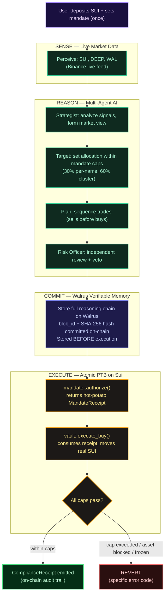
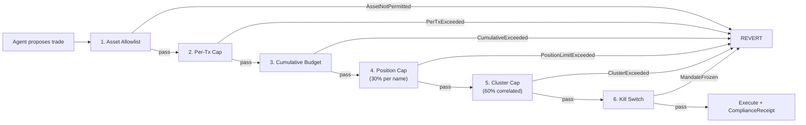
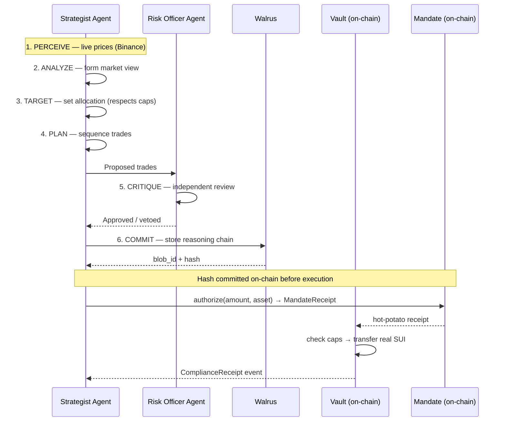

<div align="center">

# MANDATE MEMORY

[](LICENSE)
[](https://suiscan.xyz/testnet/object/0xa178dc05ac6fe50a10d555808b903badb94465e2a23f7f9a1c79764992672de7)
[](https://walrus-testnet-aggregator.nodes.guru)
[](mandate_memory/tests/)

**AI agents reason freely. The Move contract enforces. Walrus proves every decision.**

*A multi-agent system that manages DeFi positions under cryptographic mandate enforcement on Sui. Every reasoning cycle is stored as a verifiable blob on Walrus before any trade executes. The agent's authority is a Move object. Violations revert on-chain. The audit trail is cryptographic.*

[Live Demo](#) · [Explorer (Package)](https://suiscan.xyz/testnet/object/0xa178dc05ac6fe50a10d555808b903badb94465e2a23f7f9a1c79764992672de7) · [Proven Trade](https://suiscan.xyz/testnet/tx/HkB9JwLiyZt3QdUimZKowCBVPGoaWYxHA366LJQrFyYz) · [Video](#)

</div>

---

## The problem

AI agents are going to manage DeFi portfolios. That's happening now. But there are two problems nobody has solved together:

**Problem 1: The guardrails are in the agent's code.** Today's agent wallets put spending limits in Python or TypeScript — code the agent itself controls. A hallucination, a prompt injection, or a simple bug can bypass them. The "enforcement" is a suggestion, not a guarantee.

**Problem 2: Nobody can verify WHY the agent traded.** You see the trade receipt. You never see the reasoning. The agent's decision history lives in a database the operator controls — rewritable, deletable, unverifiable.

Existing approaches solve one of these. Nobody solves both:

| Approach | Constraint enforcement | Verifiable reasoning | Cross-session memory |
|----------|:-----:|:-----:|:-----:|
| Agent wallets (Beep, etc.) | — | — | — |
| DeFi vaults (Enzyme, dHEDGE) | Yes | — | — |
| MemWal (standalone) | — | Generic storage | Yes |
| **Mandate Memory** | **Move objects + PTBs** | **Walrus blobs + on-chain hash** | **Cross-cycle persistence** |

We solve all three. And we make them architecturally inseparable — the memory IS the enforcement evidence.

---

## What it does, end to end



The defining beat: **the Walrus commitment happens BEFORE execution.** The reasoning is stored, hashed, and committed on-chain before any value moves. The audit trail cannot be fabricated retroactively.

---

## Why Sui specifically

This isn't "AI with a Sui wallet bolted on." Every Sui primitive is architecturally necessary:

| Sui Primitive | How it's used | Why it can't be done elsewhere |
|---|---|---|
| **Move Objects** | The mandate IS an owned object (`key + store`, no `copy`). The agent's authority is a typed resource — can't be forged, duplicated, or transferred without owner consent. | EVM: authority is a mapping. Only Sui has object-level ownership with type-system enforcement. |
| **PTBs** | One transaction: `authorize(mandate) → check_caps → execute_buy → emit_receipt`. All atomic, no re-entrancy, composable by construction. | EVM needs multiple internal calls with re-entrancy guards. PTBs compose safely. |
| **Hot-Potato Pattern** | `MandateReceipt` has **no `drop` ability**. If `authorize()` issues it, the vault MUST consume it in the same PTB or the tx fails. Partial enforcement is impossible by construction. | Unique to Move's linear type system. No equivalent in Solidity. |
| **Walrus** | Full reasoning chain (5KB–20KB per cycle) stored as a blob. Hash committed on-chain. Auditor fetches blob, verifies hash, reads the agent's full thought process. | IPFS has no availability guarantee. Arweave is permanent but expensive. Walrus is Sui-native, erasure-coded, verifiable. |

---

## The enforcement layers

Every agent trade is checked atomically in a single PTB:



The **hot-potato `MandateReceipt`** is the enforcement primitive. The Move type system guarantees: if `authorize()` fires, `consume_receipt()` MUST fire in the same PTB. There is no execution path where the cap was checked but the trade wasn't recorded.

---

## The agentic system

This is a genuine multi-agent reasoning loop, not a single LLM prompt.



| Capability | Implementation |
|---|---|
| **Live market data** | Real prices from Binance (SUI, DEEP). Momentum and volatility computed from 24h change. |
| **Two-agent coordination** | Strategist forms the view; a separate Risk Officer independently vets every trade with a different system prompt. The Risk Officer can veto. |
| **Cross-cycle memory** | Each cycle is stored on Walrus. The agent references its prior stance, computes allocation drift, and avoids unnecessary churn. |
| **Self-critique** | The agent rejects its own violating trades before the contract does. But if it fails to, the chain catches it. |
| **Transparent reasoning** | Every phase renders in the UI: perceive, analyze, target, plan, critique, commit. |

---

## Deployed and verified on Sui testnet

| Object | Address | Status |
|--------|---------|:------:|
| **Package** (mandate, vault, memory) | [`0xa178dc05...672de7`](https://suiscan.xyz/testnet/object/0xa178dc05ac6fe50a10d555808b903badb94465e2a23f7f9a1c79764992672de7) | Verified |
| **Mandate** (caps + allowlist + freeze) | [`0x2f9a6a32...6747bf`](https://suiscan.xyz/testnet/object/0x2f9a6a32b4202952c0926e6295bddbd4c6e5d4133ee6d7cd02374555e86747bf) | Verified |
| **Vault** (holds real SUI) | [`0xb2fa78b6...1b2239`](https://suiscan.xyz/testnet/object/0xb2fa78b6f4508b7c3e22f8f04f4f6640220fc991385a9d2abba92f36ac1b2239) | Verified |

**Mandated trade proven:** `authorize()` + `execute_buy()` in one PTB → real SUI transferred → `ComplianceReceipt` + `MandateUsed` events → cumulative_used incremented → [`HkB9JwL...`](https://suiscan.xyz/testnet/tx/HkB9JwLiyZt3QdUimZKowCBVPGoaWYxHA366LJQrFyYz)

**Walrus storage proven:** reasoning chains stored as real testnet blobs, retrievable at `https://walrus-testnet-aggregator.nodes.guru/v1/blobs/{id}`.

---

## The Walrus integration

Other projects store generic data on Walrus. This project stores **mandated financial reasoning** and makes the storage architecturally inseparable from the enforcement:

1. **Reasoning chain stored BEFORE execution.** The blob exists on Walrus before any value moves. This order is enforced by the code path.

2. **Hash links reasoning to action.** The SHA-256 of the Walrus blob is the on-chain commitment. `hash(walrus_blob) == on_chain_commitment` — independently verifiable by anyone.

3. **Memory prevents churn.** The agent reads its prior Walrus blobs, computes drift, and holds when nothing changed. Cross-cycle memory is on Walrus — portable, not locked to any provider.

4. **The audit trail IS the enforcement evidence.** A compliance officer can reconstruct: what the agent thought → what it decided → what the mandate allowed → what the chain executed. Every link is cryptographic.

---

## Run locally

```bash
git clone https://github.com/Nidhicodes/Mandate-Sui
cd Mandate-Sui

# Move contracts
cd mandate_memory
sui move build
sui move test            # 6 tests, every enforcement path

# Agent backend
cd ../agent
npm install
cp .env.example .env     # add GROQ_API_KEY (free tier)
npx tsx src/server.ts    # http://localhost:3002

# Frontend
cd ../frontend
npm install
npx next dev             # http://localhost:3000
```

Open the dashboard → click **Run Agent Cycle** → watch the reasoning chain → click **Execute On-Chain** → verify on SuiScan → click the Walrus link to view stored reasoning.

---

## Architecture

```
Mandate-Sui/
├── mandate_memory/                Move package (Sui)
│   ├── sources/
│   │   ├── mandate.move           Agent authority object + hot-potato receipt + kill switch
│   │   ├── vault.move             Asset vault + atomic cap enforcement + ComplianceReceipt
│   │   └── memory.move            Walrus blob registry + cycle commitment linking
│   └── tests/
│       └── mandate_tests.move     6 tests: caps, allowlist, freeze, cumulative
│
├── agent/                          TypeScript agent service
│   └── src/
│       ├── agent.ts               6-phase reasoning loop (Strategist + Risk Officer)
│       ├── onchain.ts             PTB construction + execution via Sui SDK
│       ├── walrus.ts              Walrus blob storage + retrieval
│       ├── signals.ts             Live market data (Binance)
│       ├── config.ts              Sui / Walrus / LLM configuration
│       └── server.ts              Express API
│
├── frontend/                       Next.js + Tailwind + @mysten/dapp-kit
│   └── src/
│       ├── app/page.tsx           Dashboard: reasoning chain, vault, memory timeline
│       └── components/            Wallet connect, on-chain actions, providers
│
└── README.md
```

---

## Tech stack

| Layer | Choice | Rationale |
|---|---|---|
| Smart contracts | **Sui Move** | Object ownership, PTB atomicity, hot-potato linear types |
| Agent reasoning | **Groq (Llama 3.3 70B)** | Fast inference, two-agent system |
| Market data | **Binance** | Reliable live pricing for SUI/DEEP |
| Verifiable memory | **Walrus** (testnet) | Sui-native, erasure-coded, hash-verifiable blobs |
| On-chain execution | **Sui TypeScript SDK** | PTB construction, Ed25519 signing |
| Frontend | **Next.js, Tailwind, @mysten/dapp-kit** | Wallet connect + reasoning chain UI |
| Deploy | **Vercel (frontend), Render (agent)** | — |

---

## Differentiation

| Existing approach | Gap |
|---|---|
| "Store data on Walrus" | Generic storage, no coupling to financial enforcement |
| AI + wallet connector | No deep Move integration, code-level limits only |
| Single-agent trading bot | No independent risk review, no self-critique |
| DeFi vault with policy rules | No reasoning transparency, no verifiable audit trail |
| Generic agent memory | Not domain-specific, not linked to compliance receipts |

Mandate Memory ties Move enforcement + Walrus audit + multi-agent reasoning into one system where each component requires the others.

---

## Limitations

Stated plainly:

- **Trades use SUI transfers, not DEX routing.** The vault holds real SUI and the mandate enforcement moves real tokens through real cap checks. Production would route through DeepBook. The enforcement logic is identical either way.
- **Walrus blobs are testnet.** Real uploads, real retrievable blobs, real hashes. Mainnet deployment is identical.
- **The AI can be wrong about allocation.** That's fine — the contract catches bad proposals. A bad trade from the AI cannot result in a mandate breach, because the chain is the final arbiter.

---

## Requirements

- Sui CLI (1.70+), Node 22+
- Groq API key ([free tier](https://console.groq.com)) for real reasoning
- SUI on testnet for on-chain execution (`sui client faucet`)
- Sui Wallet, Phantom, or built-in burner wallet for frontend interaction

## License

MIT

<div align="center">

*Mandate Memory gives capital owners a cryptographic guarantee that no AI — however smart, however compromised — can break the rules they set, and a verifiable record of every decision it ever made.*

</div>
